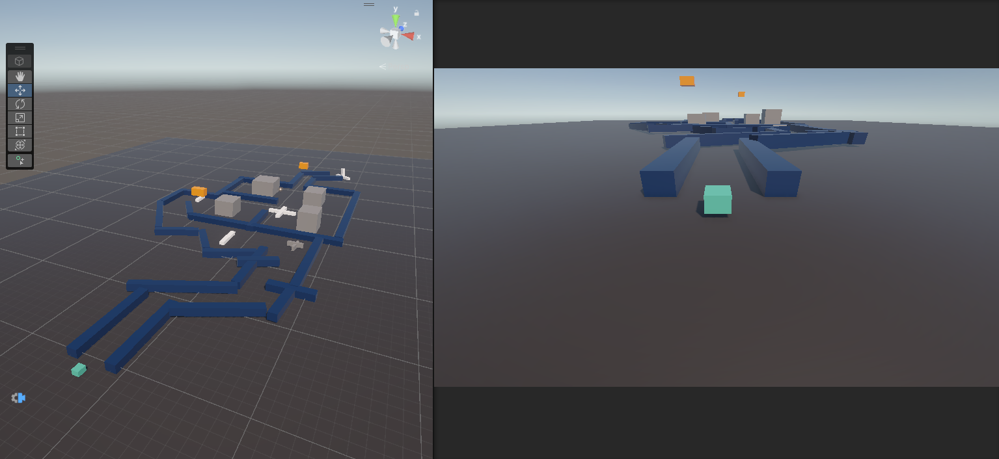
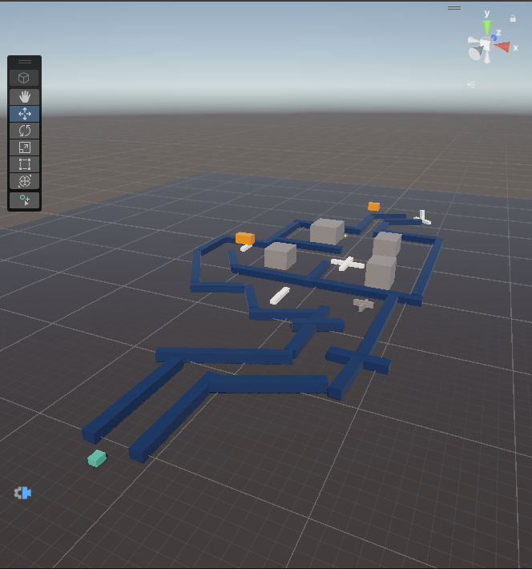

# 🎮 Obstacle Dodge

Obstacle Dodge is a 3D obstacle-dodging game developed using Unity and C#. 
The player controls a character and tries to avoid obstacles while progressing through the level.

## 📸 Screenshots




## 🎮 Gameplay

The objective of the game is to control the player, avoid obstacles, and reach the end of the level without colliding with obstacles.

## ✨ Features

- 3D game environment
- Player movement and controls
- Obstacle-based gameplay
- Collision detection
- Physics-based interactions
- Simple level design
- Interactive gameplay

## 🕹️ Controls

| Key | Action |
|-----|--------|
| W / ↑ | Move Forward |
| S / ↓ | Move Backward |
| A / ← | Move Left |
| D / → | Move Right |

## 🛠️ Technologies Used

- Unity
- C#
- Unity Physics
- Unity Input System

## 📂 Project Structure

```text
Assets/          → Game assets, scripts, scenes and materials
Packages/        → Unity packages
ProjectSettings/ → Unity project configuration


🚀 How to Run

Clone this repository.
Open the project using Unity Hub.
Open the main game scene.
Press the Play button in Unity.
Use the keyboard controls to play the game.


📚 What I Learned
Through this project, I learned the basics of:

- Unity Editor and GameObjects
- C# scripting
- Player movement
- Physics and collision detection
- Working with scenes
- Basic game development workflow


🎥 Gameplay Video
https://youtu.be/3rDEhGJWoRA


👨‍💻 Developer

Prashu Singh.
This project was created as a learning project while exploring Unity game development.